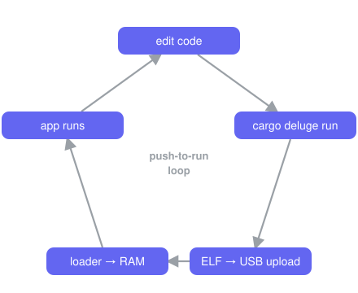

# Deluge SDK

The **Deluge SDK** — write apps for the [Synthstrom Deluge] in async Rust.

A single attribute, `#[deluge::app]`, absorbs all of the platform bring-up
(heaps, clocks, interrupts, the async executor, and a panic handler), and a
`Deluge` capability handle hands you the hardware: OLED, pads, buttons,
encoders, LEDs, audio DSP, CV/gate, MIDI, the SD card, and more. No `unsafe`,
no register pokes, no linker flags.

It is built on [Embassy] and targets the Deluge's onboard Renesas RZ/A1L
(ARM Cortex-A9, R7S721001).

```rust
#![no_std]
#![no_main]
#![feature(impl_trait_in_assoc_type)]
use deluge::prelude::*;
use embassy_time::Timer;

#[deluge::app]
async fn main(dlg: Deluge) {
    let mut led = dlg.sync_led();
    loop {
        led.toggle();                  // heaps, clocks, IRQs, executor: already up
        Timer::after_millis(200).await;
    }
}
```

> **New here?** Start with the **[Getting started guide](docs/getting-started.md)** —
> toolchain, `cargo deluge`, and your first app in five minutes.

> [!Note]
> The Deluge SDK is intended for the OLED Deluge _only_. Legacy (i.e. 7SEG) Deluges are not
> supported and use of the App Loader and SDK are untested on the 7SEG Deluge.

---

## Safe to hack on

Apps are **ELF binaries that run from RAM**, loaded by the on-device app-loader
either straight over USB (dev mode) or from the `/APPS/` folder on the SD card.
That means:

- **You can't easily brick the device.** Apps never touch flash; power-cycle to
  recover.
- **Iteration is push-to-run.** With **dev mode** on, `cargo deluge run` uploads
  the ELF over USB and the loader launches it from RAM — no SD shuffling, no
  debug probe.

<p align="center">
  
</p>

---

## Quick start

```sh
rustup show                          # installs the pinned nightly + target
cargo install --path tools/cargo-deluge

cargo deluge new myapp
cd myapp
cargo deluge run                     # build + upload over USB, launch from RAM
```

`cargo deluge run` needs a Deluge running the **app-loader** with **dev mode**
on. Flashing the app-loader is a one-time step — see
**[Installing the loader](docs/app-loader.md#installing-the-loader)**. Without dev
mode, `cargo deluge deploy` copies the ELF to a mounted SD card's `/APPS/` instead.
No hardware at all? `cargo deluge sim` runs the app in the
[desktop simulator](docs/simulator.md).

---

## The capability handle

`#[deluge::app] async fn main(dlg: Deluge)` receives a `Deluge` handle. Each
accessor takes ownership of one peripheral (takeable once — a second call
panics), so the type system keeps two parts of your app from driving the same
hardware. Async accessors bring the peripheral up and wait for it before
returning.

| Accessor | Hands you | What it drives |
|----------|-----------|----------------|
| `dlg.oled().await` | `Oled` | SSD1309 OLED — an `embedded-graphics` `DrawTarget` |
| `dlg.input()` | `Input` | unified `Event` stream: pads, buttons, encoders |
| `dlg.pads().await` | `Pads` | the 18×8 RGB pad grid |
| `dlg.leds().await` | `Leds` | button/indicator LEDs + gold-knob columns |
| `dlg.audio()` | `Audio` | per-block stereo DSP over the codec |
| `dlg.cv()` / `dlg.gate()` | `Cv` / `Gate` | CV and gate outputs |
| `dlg.clock_in()` / `dlg.clock_out(ch)` | `ClockIn` / `ClockOut` | analog trigger-clock in / out |
| `dlg.midi()` | `Midi` | DIN MIDI port |
| `dlg.jacks()` | `Jacks` | audio jack-detect + speaker-amp control |
| `dlg.sd().await` | `Sd` | FAT filesystem on the SD card |
| `dlg.sync_led()` | `SyncLed` | the SYNC LED |
| `dlg.spawner()` | `Spawner` | Embassy spawner for your own background tasks |

`use deluge::prelude::*;` brings the handle, all capability types, the
`#[deluge::app]` macro, `controls` (named button/encoder ids), and the `log`
macros (`info!`, `warn!`, …) into scope. Fixed-point DSP types live under
`deluge::fixed` (`Q31`, `Q16`, …) for audio callbacks.

### Optional features (on the `deluge` crate)

| Feature | Effect |
|---------|--------|
| `rtt` | route `log` to RTT (SEGGER Real-Time Transfer), needs a debug probe |
| `usb-log` | route `log` to a USB CDC serial port — visible over the cable, **no probe** |
| `usb-serial` | take USB0 as a CDC-ACM serial port under your own VID/PID via `Deluge::usb_serial` — device-only, mutually exclusive with `usb-log` |
| `alloc` | register the on-chip SRAM heap as the global allocator (needed for the UI toolkit; requires `-Zbuild-std=core,alloc`) |
| `audio-irq` | drive `dlg.audio()` from the per-block RX-DMA interrupt (drift-free, lower latency) |
| `sim` | host backend for the desktop simulator (`cargo deluge sim`) |
| `linux` | backend for the Deluge's Linux userland via `libdeluge` (`cargo deluge linux`) |

---

## `cargo deluge`

The host subcommand so you never touch `-Zbuild-std`, linker flags, or the
embedded target triple by hand:

| Command | Does |
|---------|------|
| `cargo deluge new <name>` | scaffold a new app crate |
| `cargo deluge build [--release]` | build the current app → ELF |
| `cargo deluge run [--release] [--port <p>] [--log]` | build, upload over USB, launch from RAM (needs dev mode) |
| `cargo deluge deploy [--release] [--dest <mount>]` | copy the ELF to a mounted SD card's `/APPS/` |
| `cargo deluge log [--port <p>]` | stream a running app's USB serial log (`usb-log` feature) |
| `cargo deluge sim [--release] [--headless …]` | build for the host and run in the [desktop simulator](docs/simulator.md) |
| `cargo deluge linux [opts]` | build for the Deluge's Linux userland and pack a bootable image (needs `DELUGE_BASE`) |
| `cargo deluge debug [--release] [-- …]` | build, then `probe-rs run` over J-Link |
| `cargo deluge trace [--release] [--flow] [-- …]` | build, then `probe-rs read-trace` (`trace-a9` fork) |

---

## Examples

Every example under [`examples/`](examples/) is a complete, buildable app. Build
and run any of them with `cargo deluge run` from its directory (CI
compile-proves all of them on the firmware target).

| Example | Shows |
|---------|-------|
| [`blinky`](examples/baremetal/blinky/) | the minimal app — one `async` loop, no `unsafe` |
| [`oled_hello`](examples/baremetal/oled_hello/) | draw to the OLED with `embedded-graphics` |
| [`oled_menu`](examples/baremetal/oled_menu/) | immediate-mode settings menu (UI toolkit) |
| [`oled_hmenu`](examples/baremetal/oled_hmenu/) | horizontal param-column menu (UI toolkit) |
| [`input_demo`](examples/baremetal/input_demo/) | react to the unified input event stream |
| [`pad_paint`](examples/baremetal/pad_paint/) | press pads to paint the RGB grid |
| [`button_leds`](examples/baremetal/button_leds/) | light each button's LED while held |
| [`midi_cv`](examples/baremetal/midi_cv/) | DIN MIDI → CV/gate converter |
| [`clock_jacks`](examples/baremetal/clock_jacks/) | clock I/O + jack detection |
| [`audio_passthru`](examples/baremetal/audio_passthru/) | a line-in audio effect |
| [`audio_passthru_irq`](examples/baremetal/audio_passthru_irq/) | the same, on the per-block IRQ clock |
| [`test_osc`](examples/baremetal/test_osc/) | the pad grid as an isomorphic polyphonic synth keyboard |
| [`additive_osc`](examples/baremetal/additive_osc/) | additive synth with a C++/[Argon](https://github.com/stellar-aria/argon) (NEON SIMD) DSP core over FFI — needs `ARGON_SRC` (see its README) |
| [`sd_demo`](examples/baremetal/sd_demo/) | SD-card write/read round-trip |
| [`usb_log`](examples/baremetal/usb_log/) | stream `log` output over USB — no probe |

---

## Documentation

- **[Getting started](docs/getting-started.md)** — toolchain, `cargo deluge`,
  and a tour of every capability. Read this first.
- **[App Loader Manual](docs/app-loader.md)** — installing the loader, the boot
  menu, dev mode, storing apps to flash, and recovery.
- **[Desktop simulator](docs/simulator.md)** — build and debug apps without
  hardware: the panel, audio/MIDI/SD bridges, and headless golden-frame testing.
- **[Advanced developer guide](docs/advanced-guide.md)** — Embassy tasks,
  interrupts, the HAL/BSP layers, and Cortex-A9 trace tooling.
- **[Wren scripting](docs/wren-scripting.md)** — live-code the Deluge in
  [Wren](https://wren.io) with `wren-firmware`.
- **[Linux examples](examples/linux/README.md)** — apps for the Deluge's Linux
  userland.

---

## Repository layout

| Path | Crate | What |
|------|-------|------|
| `crates/deluge-sdk` | `deluge-sdk` (imported as `deluge`) | the SDK facade + `#[deluge::app]` runtime |
| `crates/deluge-sdk-macros` | `deluge-sdk-macros` | the `#[deluge::app]` proc-macro |
| `crates/deluge-bsp` | `deluge-bsp` | board support: peripherals, PIC, OLED, SD, … |
| `crates/rza1l-hal` | `rza1l-hal` | RZ/A1L hardware abstraction layer |
| `crates/deluge-alloc` | `deluge-alloc` | SRAM / SDRAM heap allocators |
| `crates/deluge-image` | `deluge-image` | firmware-image format logic shared by the app-loader and `cargo deluge` |
| `crates/deluge-fixedpoint` (imported as `fixedpoint`), `crates/armv7-dsp-intrinsics` | | fixed-point DSP math + ARMv7 intrinsics |
| `crates/deluge-simulator`, `crates/deluge-sim-link`, `crates/deluge-protocol` | | the desktop simulator and its link/wire protocol |
| `crates/deluge-ui-toolkit`, `crates/deluge-grid-toolkit` | | OLED menu/text and pad-grid UI toolkits (GPL) |
| `crates/deluge-fonts` | `deluge-fonts` | bitmap fonts for the toolkit (GPL) |
| `linux/` | | the native Linux backend: `deluge-sys` (libdeluge FFI), `deluge-hal-linux`, `deluge-linux-ui` |
| `wren/` | | the Wren scripting subsystem: VM (`wren-sys`), bindings (`deluge-wren-core`), `wren-firmware`, and the web editor/debugger |
| `firmwares/` | | standalone firmware images: the app-loader (second-stage bootloader), demo, controller, MSC |
| `hw-tests/` | | single-purpose hardware bring-up / validation probes |
| `examples/baremetal/`, `examples/linux/` | | SDK example apps for each backend |
| `tools/cargo-deluge/` | | the `cargo deluge` host subcommand |
| `tools/deluge-web-sim/` | | browser front panel that connects to a simulator core over WebSocket |

The audio engine (`flare`, `flare-graph`, `flare-kernels`, `flare-fft`,
`flare-mipgen`) lives in the separate `flare` repository and is used through
path dependencies on a sibling checkout at `../flare`.

The `deluge` SDK facade depends only on the BSP and HAL — it does **not** pull
in the GPL UI toolkit, so an app stays permissively licensed unless it opts in.

---

## Target

| Property | Value |
|----------|-------|
| CPU | ARM Cortex-A9, ARMv7-A, 400 MHz |
| SoC | Renesas RZ/A1L (R7S721001) |
| RAM | 3 MB on-chip SRAM + 64 MB SDRAM |
| Rust target | `armv7a-none-eabihf` |
| Rust channel | nightly (pinned in [`rust-toolchain.toml`](rust-toolchain.toml)) |
| Async runtime | [Embassy] |

---

## Licensing

The SDK and core libraries are **`MIT OR Apache-2.0`**. The OLED UI toolkit
(`crates/deluge-ui-toolkit`), its fonts (`crates/deluge-fonts`) and the pad-grid
toolkit (`crates/deluge-grid-toolkit`) are **`GPL-3.0-or-later`** (see
[`LICENSE-GPL`](LICENSE-GPL)). They are standalone crates: the permissive
`deluge` facade does **not** depend on them, so an app stays MIT/Apache unless
it opts into the toolkit, in which case that app becomes GPL.

---

## Working on the SDK itself

The sections below are for hacking on the firmware and SDK internals rather than
writing apps. App authors can stop at [`cargo deluge`](#cargo-deluge).

### Workspace setup

The workspace resolves the `flare` audio engine from a sibling checkout, so clone
it next to this repository first:

```text
<parent>/
├── deluge-sdk/   # this repository
└── flare/        # the audio engine
```

### Building firmware images

`.cargo/config.toml` sets `target = "armv7a-none-eabihf"` and defines build
aliases that pass the required `-Zbuild-std=core` flags — always use them over a
bare `cargo build`:

| Command | Output |
|---------|--------|
| `cargo build-fw -p <crate>` | debug ELF (add `--features rtt` for RTT logging) |
| `cargo build-fw-rel -p <crate>` | release ELF, default features off |
| `cargo build-fw-bin` | demo-firmware as a raw `.bin` image to flash as the device firmware |

The app-loader and other firmwares have their own aliases
(`cargo build-app-loader` / `-bin`, `cargo build-controller-bin`,
`cargo build-msc` / `-bin`, `cargo build-wren` / `-bin`); see each crate's
README. Every image is a RAM-linked ELF (loaded at SRAM `0x20020000`).

### Testing

The default target is bare-metal, so tests run on two host-side targets:
**QEMU ARM** (`armv7-unknown-linux-gnueabihf`) for crates using ARM
asm/intrinsics, and the **host** triple for pure-logic crates. Run everything
with:

```sh
./tools/test.sh
```

One-time setup:

```sh
rustup target add armv7-unknown-linux-gnueabihf x86_64-unknown-linux-gnu
# Debian/Ubuntu: sudo apt-get install qemu-user gcc-arm-linux-gnueabihf libudev-dev
# Arch:          sudo pacman -S qemu-user-static arm-linux-gnueabihf-gcc
```

The `qemu-arm` runner and ARM cross-linker are wired up in `.cargo/config.toml`.

### Debugging

Two probe backends are supported: **J-Link** (stable, recommended) and a custom
[`probe-rs` fork][probe-rs-fork] with Cortex-A9 PTM/ETF trace support
(`trace-a9` branch).

For J-Link, open the project in VS Code with [Cortex-Debug] and use the
launch configs in [`.vscode/launch.json`](.vscode/launch.json) — they load the
ELF via [`rza1_debug.JLinkScript`](rza1_debug.JLinkScript) and attach RTT
(written to `rtt.log`). `cargo deluge debug` / `cargo deluge trace` wrap the
probe-rs-fork commands with the right chip preset and flags; see the
[Advanced developer guide](docs/advanced-guide.md) for the full trace workflow.

### CI

The [CI workflow](.github/workflows/ci.yml) runs on every push to `main` and on
pull requests:

- **Images** — builds the app-loader and the demo/controller firmwares.
- **Examples** — compile-proves every SDK example on the firmware target.
- **Tests** — the host + QEMU-ARM unit suite.

[Synthstrom Deluge]: https://synthstrom.com/product/deluge/
[Embassy]: https://embassy.dev
[Cortex-Debug]: https://marketplace.visualstudio.com/items?itemName=marus25.cortex-debug
[probe-rs-fork]: https://github.com/stellar-aria/probe-rs/tree/trace-a9
