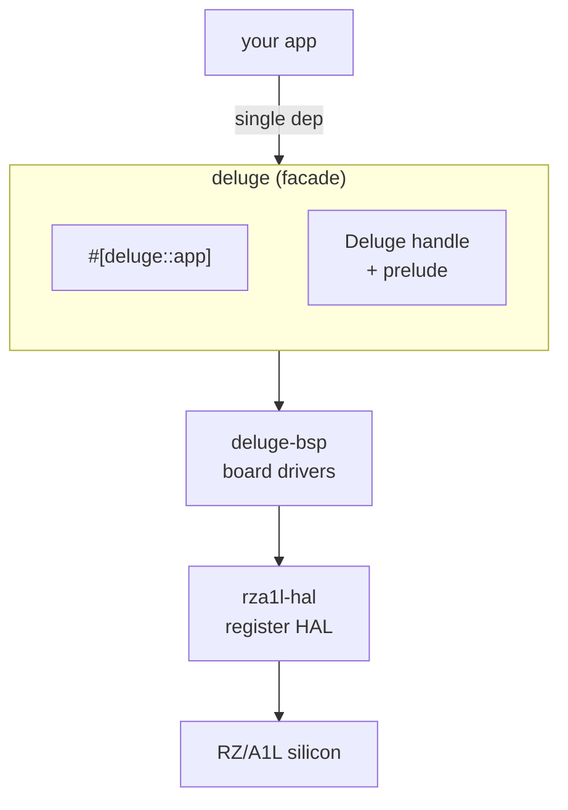
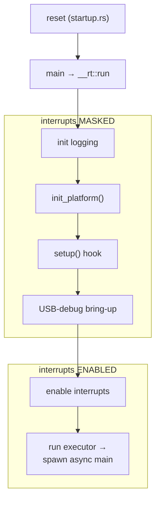
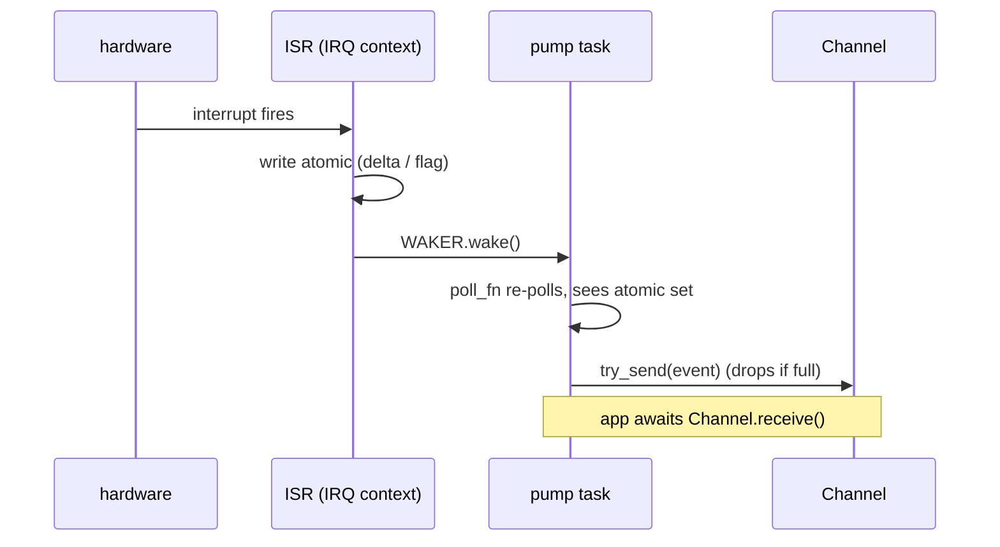
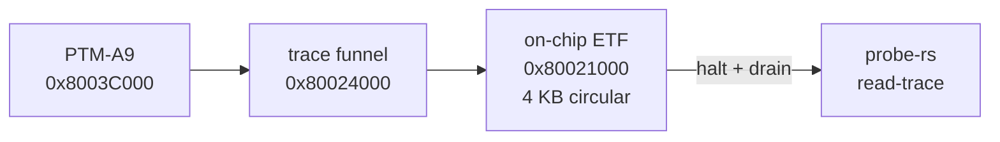

# Advanced developer guide

This guide is for developers who already know Rust and embedded async, and want to
go past the friendly capability API: spawn their own Embassy tasks, register
interrupts, allocate into SDRAM, talk to the HAL/BSP directly, write a peripheral
driver, and use the Cortex-A9 trace tooling. If you haven't yet, read the
[Getting started guide](getting-started.md) first.

> **Hardware:** Renesas RZ/A1L (`R7S721020`), single-core ARM Cortex-A9 (ARMv7-A) at
> ~400 MHz, 3 MB on-chip SRAM + 64 MB external SDRAM, NEON/VFPv3. Bare-metal target
> `armv7a-none-eabihf`, nightly toolchain.

## Contents

1. [The layer cake](#1-the-layer-cake)
2. [Boot & runtime in depth](#2-boot--runtime-in-depth)
3. [The Embassy model](#3-the-embassy-model)
4. [Concurrency patterns](#4-concurrency-patterns)
5. [Interrupts & the GIC](#5-interrupts--the-gic)
6. [Memory & allocators](#6-memory--allocators)
7. [Dropping down to the BSP & HAL](#7-dropping-down-to-the-bsp--hal)
8. [Audio internals](#8-audio-internals)
9. [Debugging & tracing with the probe-rs Cortex-A9 fork](#9-debugging--tracing-with-the-probe-rs-cortex-a9-fork)
10. [Build variants & tooling](#10-build-variants--tooling)
11. [Reference: HAL & BSP module map](#11-reference-hal--bsp-module-map)

---

## 1. The layer cake



`deluge-bsp` holds the board drivers (OLED, PIC, audio, SD, …); `rza1l-hal` is the
register-level HAL (GIC, DMAC, SSI, …).

The `deluge` facade **re-exports both lower layers**, so you reach everything through
one dependency:

```rust
use deluge::prelude::*;
use deluge::{deluge_bsp, rza1l_hal};   // re-exported
use deluge::fixed;                     // = the `fixedpoint` crate (Q31/Q16 DSP math)
```

There is **no svd2rust PAC** — the HAL does raw, typed MMIO (see
[§7](#writing-a-peripheral-driver)). That keeps it small and host-testable.

The friendly `Deluge` accessors (`oled()`, `audio()`, …) are thin wrappers; when you
need something they don't expose, drop straight to `deluge_bsp::*` / `rza1l_hal::*`.
Mixing the two is fine, but remember the SDK's take-once handles assume they own
their hardware — don't drive the same peripheral from both a capability handle and a
raw HAL call.

---

## 2. Boot & runtime in depth

The `#[deluge::app]` macro ([`crates/deluge-macros/src/lib.rs`](../crates/deluge-macros/src/lib.rs))
generates an `extern "C" fn main` that calls `deluge::__rt::run`. The runtime lives
in [`crates/deluge/src/lib.rs`](../crates/deluge/src/lib.rs) (`__rt` module) and runs
this sequence:

1. **Logging** — initialise the RTT or USB-CDC logger (feature-gated; one global logger).
2. **`init_platform()`** (interrupts masked):
   - `rza1l_hal::allocator::SRAM.init(...)` from the linker symbols `__sram_heap_start` / `__sram_heap_end`.
   - `deluge_bsp::system::init_clocks()` — CPG/PLL, MMU, L1+L2 caches, SDRAM controller, GIC, and the OSTM embassy-time driver.
   - `rza1l_hal::allocator::SDRAM.init(0x0C00_0000, 64 MiB)`.
3. **`setup()`** — your optional `#[deluge::app(setup = …)]` hook, still with **IRQs masked** (see [§5](#the-setup-window)).
4. **USB-debug bring-up** (only with `usb-log`): register the USB0 ISR and start the controller while IRQs are still masked, mirroring the proven controller-firmware ordering.
5. **`cortex_ar::interrupt::enable()`** — unmask IRQs so the time driver and peripheral ISRs fire.
6. **Executor** — construct a `static` `embassy_executor::Executor`, then `executor.run(...)`, which spawns your `async fn main` (and the USB-log drain task, if enabled).



Boot from cold takes ~6.5 s under a probe download; the clock/cache/SDRAM bring-up is
the bulk of it.

The startup assembly (cache/TLB invalidate, MMU off, NEON enable, per-mode stacks,
BSS zero, then `main`) and the fixed bootloader metadata at offset `+0x20` live in
[`crates/rza1l-hal/src/startup.rs`](../crates/rza1l-hal/src/startup.rs). Apps are
loaded as ELF and run from RAM, so this startup runs every launch — there is no flash
programming in the app path.

---

## 3. The Embassy model

**Single-threaded, single-core.** One `Executor` (`platform-cortex-ar`,
`executor-thread`); no SMP. Tasks are cooperative — they only yield at `.await`, and
preemption happens only at interrupt boundaries. Task futures don't need `Send`
because they never migrate cores.

**Versions / features** (workspace [`Cargo.toml`](../Cargo.toml)):

| Crate | Version | Features used |
|-------|---------|---------------|
| `embassy-executor` | 0.10 | `nightly`, `platform-cortex-ar`, `executor-thread` |
| `embassy-time` | 0.5 | `tick-hz-1_000_000` (1 µs/tick) |
| `embassy-sync` | 0.8 | — |
| `embassy-futures` | 0.1 | — |
| `embassy-usb` | 0.6 | optional (`usb-log`, USB device classes) |

`#![feature(impl_trait_in_assoc_type)]` is mandatory in every app crate: the
`#[embassy_executor::task]` expansion the macro emits needs it.

**Spawning your own tasks.** Get the `Spawner` from the handle. In this Embassy
version a `#[task]` fn returns a `Result` (it can fail only on pool exhaustion), so
the idiom — matching the macro expansion and `demo-firmware` — is `spawn(task().unwrap())`:

```rust
#[embassy_executor::task]
async fn heartbeat() {
    loop {
        log::info!("alive");
        embassy_time::Timer::after_secs(1).await;
    }
}

#[deluge::app]
async fn main(dlg: Deluge) {
    dlg.spawner().spawn(heartbeat().unwrap());
    // ... your main loop ...
}
```

A `#[task]` has a fixed pool (default size 1); spawn the same task fn more than once
and you need `#[embassy_executor::task(pool_size = N)]`.

**Time driver.** `embassy-time` is backed by the RZ/A1L OSTM in
[`crates/rza1l-hal/src/time_driver.rs`](../crates/rza1l-hal/src/time_driver.rs):
OSTM0 free-runs as the monotonic clock (32-bit, ~128 s wrap; an overflow ISR extends
it to 64-bit), OSTM1 is the one-shot alarm. Ticks are 1 µs; the driver converts with
exact rational arithmetic (`× 640 / 21_161`) to avoid drift off the 33.064 MHz P0
clock. So `Timer::after_*`, `Ticker::every`, `Instant::now`, and `Duration` all
resolve onto OSTM — no custom timing needed.

**USB interface budget.** `EMBASSY_USB_MAX_INTERFACE_COUNT = "8"` is set in
[`.cargo/config.toml`](../.cargo/config.toml). Adding USB classes beyond that count
fails at compile time — bump it.

---

## 4. Concurrency patterns

The SDK funnels hardware events into tasks with two idioms worth copying.

### Lazy service task (`ensure_started`)

A take-once guard that spawns a long-lived background "pump" exactly once, no matter
how many capabilities ask for it. See
[`crates/deluge/src/pic_service.rs`](../crates/deluge/src/pic_service.rs):

```rust
static STARTED: AtomicBool = AtomicBool::new(false);

pub(crate) fn ensure_started(spawner: Spawner) {
    if STARTED.swap(true, Ordering::Relaxed) {
        return;                       // already running
    }
    spawner.spawn(pump().unwrap());
}

#[embassy_executor::task]
async fn pump() { /* read bytes, parse, route events into a Channel */ }
```

### ISR → task wakeup (`AtomicWaker` + `poll_fn`)

ISRs can't `.await`. The pattern: the ISR writes an atomic and calls `WAKER.wake()`;
the task parks in a `poll_fn` that registers the waker and checks the atomic.



From the encoder pump in [`crates/deluge/src/input.rs`](../crates/deluge/src/input.rs):

```rust
poll_fn(|cx| {
    encoder::ENCODER_WAKER.register(cx.waker());
    if encoder::ENCODER_DELTAS.iter().any(|d| d.load(Ordering::Relaxed) != 0) {
        Poll::Ready(())
    } else {
        Poll::Pending
    }
}).await;
```

`register()` runs on *every* poll (the waker store holds one waker; the single
consumer makes that safe).

### Choosing a sync primitive

All raw-mutex types are `CriticalSectionRawMutex` — on a single core, "critical
section" means *mask interrupts*, which is exactly what's needed for atomicity across
an ISR boundary; there's no real lock contention.

| Primitive | Where it's used | Use it for |
|-----------|-----------------|------------|
| `channel::Channel<CS, T, N>` | input events (`input.rs`) | bounded producer→consumer queue |
| `pipe::Pipe<CS, N>` | USB log (`usb_debug.rs`) | byte stream / ring buffer |
| `waitqueue::AtomicWaker` | encoders, PIC, DMAC | single-consumer ISR wakeups |
| `mutex::Mutex<CS, T>` | RSPI0 bus guard (`bus.rs`) | shared peripheral ownership |
| `signal::Signal<CS, T>` | handshakes | latest-value notification |

**Producers from ISR/background context use `try_send`, not `send`** — dropping an
event is safer than blocking the producer when a consumer falls behind.

`demo-firmware` ([`firmwares/demo-firmware/src/tasks/`](../firmwares/demo-firmware/src/tasks/))
is the real-world multi-task example: a dozen-plus tasks (USB, UAC2 audio in/out, USB
+ DIN MIDI, PIC pump, encoders, jack-detect, FFT analysis, RGB render, OLED render,
SD I/O) coordinating through atomics, shared buffers, and signals.

---

## 5. Interrupts & the GIC

The interrupt controller is a GIC-400 with 587 sources, wrapped in
[`crates/rza1l-hal/src/gic.rs`](../crates/rza1l-hal/src/gic.rs). Handlers are plain
`fn()` (`type Handler = fn()`). All entry points are `unsafe`:

```rust
use deluge::rza1l_hal::gic;

unsafe {
    gic::register(id, my_isr);   // install handler in the dispatch table
    gic::set_priority(id, 16);   // 0 = highest, 31 = disabled — set < 31 BEFORE enable
    gic::enable(id);             // unmask in GICD_ISENABLER
}

fn my_isr() { /* runs in IRQ context: no .await, no allocation; wake a task */ }
```

For the external IRQ pins there are edge-config helpers:
`gic::set_irq_both_edges(n)`, `gic::set_irq_falling_edge(n)`, `gic::clear_irq_pending(n)`.

### The `setup` window

`gic::register`/`enable` and most GIC source configuration **must happen with IRQs
masked**, before the executor enables them. That's exactly what the macro's `setup`
hook is for:

```rust
#[deluge::app(setup = setup)]
async fn main(dlg: Deluge) { /* IRQs on, executor running */ }

fn setup() {
    // IRQs masked here. Register your ISRs and configure GIC sources.
    unsafe {
        gic::register(my_id, my_isr);
        gic::set_priority(my_id, 16);
        gic::enable(my_id);
    }
}
```

`setup` is synchronous, must not `.await`, and should return quickly (it blocks the
executor from starting). If your driver instead registers its ISR lazily on first use
(the BSP does this for several peripherals), you don't need `setup` — but be aware
the first call then runs with IRQs already enabled.

`gic::init()` itself is already done for you inside `system::init_clocks()`.

---

## 6. Memory & allocators

### Layout (`memory.x`)

The scaffold's `memory.x` (and the firmware variants) place:

- **SRAM** at `0x2002_0000`–`0x2030_0000` (the app load region; the bootloader owns
  the low SRAM below `0x2002_0000`), with per-mode stacks carved out at the top.
- **SDRAM** at `0x0C00_0000`, 64 MB.

The RTT build (`memory_rtt.x` + the `rtt` feature) additionally reserves a
`.rtt_buffer` region; `build.rs` selects the matching layout and linker script
(`rza1l.x` vs `rza1l_rtt.x` from the HAL). The runtime reads `__sram_heap_start` /
`__sram_heap_end` from the script.

The MMU maps a **non-cached mirror** of every region at `+0x4000_0000`
([`crates/rza1l-hal/src/mmu.rs`](../crates/rza1l-hal/src/mmu.rs),
`UNCACHED_MIRROR_OFFSET`). DMA ring buffers are accessed through that mirror so you
never fight the D-cache for hardware-visible memory.

### Two heaps

Both are `allocator-api` `Allocator`s (critical-section guarded) in
[`crates/rza1l-hal/src/allocator.rs`](../crates/rza1l-hal/src/allocator.rs):

- **`rza1l_hal::allocator::SRAM`** — fast on-chip RAM. The `alloc` feature registers
  it as the `#[global_allocator]`, so `Box`/`Vec`/`String`/`format!` work. Keep this
  for app state and UI.
- **`rza1l_hal::allocator::SDRAM`** — the big, higher-latency external RAM. Reserve it
  for bulk audio buffers (samples, delay lines) and allocate into it *explicitly* so
  it never fragments the global heap:

```rust
#![feature(allocator_api)]
use deluge::rza1l_hal::allocator::SDRAM;

let mut delay_line = Vec::<f32, _>::with_capacity_in(48_000, &SDRAM);
let buf = Box::new_in([0i32; 4096], &SDRAM);
```

`Allocator` (and `allocator_api`) require nightly and the `alloc` feature (which adds
`alloc` to `build-std`, via the `cargo build-fw-alloc` alias). Query usage with
`SRAM.used()` / `.free()` / `.size()`.

---

## 7. Dropping down to the BSP & HAL

### RSPI0 bus arbitration

The OLED (8-bit frames) and the CV DAC (32-bit frames) share RSPI0. Coordinate
through the guard in [`crates/deluge-bsp/src/bus.rs`](../crates/deluge-bsp/src/bus.rs)
rather than touching the peripheral directly:

```rust
use deluge::deluge_bsp::bus;

let mut rspi = bus::lock_rspi0().await;   // exclusive, async-acquired
rspi.enter_32bit();                       // reconfigure frame size if needed
rspi.send32_blocking(word);
rspi.wait_end();
// guard drops -> bus released
```

`enter_8bit()` / `enter_32bit()` only reconfigure when the mode actually changes.
There's also `try_lock_rspi0()` (non-blocking, startup use) and
`unsafe steal_rspi0()` — the latter is reserved for the panic handler, which needs
the bus while the world is stopped.

### The PIC co-processor

Pads, buttons, encoders, and the OLED chip-select handshake all ride a UART link to
the on-board PIC. [`crates/deluge-bsp/src/pic.rs`](../crates/deluge-bsp/src/pic.rs)
exposes the `Parser`, the `Event` enum, `pad_coords(id)`, and the async handshakes
(`wait_ready`, `wait_oled_selected`). The SDK's `pic_service` pump (see [§4](#lazy-service-task-ensure_started))
is the consumer; reuse that rather than re-driving the UART.

### Writing a peripheral driver

There's no PAC — use the typed MMIO seam in
[`crates/rza1l-hal/src/mmio.rs`](../crates/rza1l-hal/src/mmio.rs). On `target_os =
"none"` these are `read_volatile`/`write_volatile`; on the host test target they hit a
shadow memory + access log so your driver is unit-testable.

```rust
use deluge::rza1l_hal::mmio::{self, Reg32};

const MYDEV_CTRL: Reg32 = Reg32(0xE8XX_X000);
unsafe {
    let v = MYDEV_CTRL.read();
    MYDEV_CTRL.write(v | ENABLE);
    // or untyped: mmio::write32(addr, val) / mmio::read32(addr)
}
```

Follow the existing drivers (`rspi.rs`, `dmac.rs`, `ssi.rs`) for the conventions:
`const` offset + bitfield constants, `const fn` address helpers, and `AtomicWaker`
for the async completion path. Register your IRQ in the GIC (see [§5](#5-interrupts--the-gic)).

---

## 8. Audio internals

The `Audio` capability runs a per-block DSP callback over the codec. Under the hood
([`crates/deluge-bsp/src/audio_block.rs`](../crates/deluge-bsp/src/audio_block.rs)):

- Audio runs on the **direct SSI0 TX+RX path** (I²S, 44.1 kHz stereo) — SCUX is only
  for sample-rate conversion, not this path.
- `SAMPLE_RATE_HZ = 44_100`, `BLOCK_FRAMES = 128` (~2.9 ms/block). A `Frame` is
  `{ l: f32, r: f32 }` in `[-1.0, 1.0]`.
- The block tap *follows the DMA ring*: it reads from the uncached RX ring and writes
  ahead of the DMA read head into the uncached TX ring (a write-ahead cushion). The TX
  ring is primed with dither so the codec doesn't auto-mute on startup.

Two clocking modes, same `process()` API:

- **Default** — a `Ticker`-paced poll loop. Simple, robust.
- **`audio-irq` feature** — a per-block RX-DMA interrupt clock (16-descriptor ring
  tiling with a re-arm handler in the DMAC driver). Drift-free and lower-latency; the
  write-ahead cushion shrinks accordingly. See `examples/audio_passthru_irq`.

For DSP math inside the callback, `deluge::fixed` (the `fixedpoint` crate) gives
type-safe `Q31`/`Q16` arithmetic that lowers to the Cortex-A9's hardware DSP/NEON
instructions (`SMMUL`, `SSAT`, `QADD`, `VCVT`).

---

## 9. Debugging & tracing with the probe-rs Cortex-A9 fork

Stock probe-rs doesn't support the Cortex-A9 / RZ/A1L. Use the **`trace-a9` fork**
([`stellar-aria/probe-rs`, branch `trace-a9`][probe-rs-fork]), which adds RZ/A1L debug
sequences, a PTM instruction-trace decoder, and a Cortex-A9 PMU driver. A J-Link is
the recommended probe.

```sh
git clone -b trace-a9 https://github.com/stellar-aria/probe-rs
cargo install --path probe-rs/probe-rs-tools --locked
```

[probe-rs-fork]: https://github.com/stellar-aria/probe-rs/tree/trace-a9

The chip name is **`R7S721020`** (the RZ/A1LU variant on the Deluge; siblings
`R7S721010` / `R7S721030` also work).

### Run, attach, RTT

```sh
# Download to RAM and run, streaming RTT to the terminal:
probe-rs run --chip R7S721020 target/armv7a-none-eabihf/debug/<binary>

# GDB server (then connect your debugger):
probe-rs gdb --chip R7S721020
```

The fork halts the core in place rather than issuing a warm reset (which the ROM would
turn into a re-load from QSPI), then cleanly invalidates L1/L2 and disables the GIC
before branching to your RAM image. For **RTT**, note the SDK's buffer sits in cached
SRAM (`0x2002_0000`); the RZ/A1L target definition scans the **non-cached mirror**
(`0x6000_0000`) so reads aren't stale.

For J-Link via VS Code + Cortex-Debug instead, see the
[root README's Debugging section](../README.md#debugging) (it uses
`rza1_debug.JLinkScript` to halt and configure direct SRAM execution).

### Instruction trace

The trace chain is **PTM-A9 → trace funnel → on-chip ETF** (a 4 KB circular buffer).



PTM-A9 emits instruction packets; the funnel routes them to the ETF FIFO; `read-trace`
halts the core, drains the buffer over JTAG, and decodes/symbolises against your ELF.

`probe-rs read-trace` captures a window, then decodes/symbolises it against your ELF:

```sh
# Compact control-flow (ISync + branch targets, symbolised):
probe-rs read-trace --chip R7S721020 --duration-ms 2000 --flow \
    --elf target/armv7a-none-eabihf/debug/<binary>

# Every executed instruction (verbose, needs the ELF):
probe-rs read-trace --chip R7S721020 --duration-ms 2000 --full-flow --elf <binary>

# Flat hot-function profile:
probe-rs read-trace --chip R7S721020 --duration-ms 5000 --profile --top-n 10 --elf <binary>

# Firefox Profiler flamegraph (load the output with `samply load`):
probe-rs read-trace --chip R7S721020 --duration-ms 10000 \
    --samply-output profile.json.gz --samply-clock-mhz 400 --elf <binary>

# Raw bytes for offline decode, or JSON Lines for scripting:
probe-rs read-trace --chip R7S721020 --duration-ms 2000 --output trace.bin
probe-rs read-trace --chip R7S721020 --duration-ms 2000 --decode --elf <binary> \
    --output-format json 2>/dev/null | jq 'select(.type == "Branch")'
```

Other useful flags: `--source` (file:line, needs `--elf`), `--continuous` (loop until
Ctrl-C), `--timestamps`, `--return-stack`, `--branch-broadcast`, `--trace-id`.

**Limitation:** trace is **full-stop only** — the core is halted to drain the ETF;
there's no non-stop streaming yet. The 4 KB ETF holds on the order of ~1 K
instructions per sync point in circular mode.

### Performance counters (PMU)

```sh
probe-rs pmu --chip R7S721020 --duration-ms 2000 \
    --events inst-retired,br-mis-pred,l1d-cache-refill
```

Six event counters + the cycle counter. **Cortex-A9 gotcha:** the architectural
"instructions retired" event `0x08` reads 0 on the A9 — the fork maps `inst-retired`
to the A9-specific `0x68` (and `br-return-retired` to `0x6E`) for you. Available
event names include `cpu-cycles`, `l1i-cache-refill`, `l1d-cache`, `dtlb-refill`,
`br-mis-pred`, `br-pred`, `icache-stall`, `dcache-stall`, `strex-failed`,
`data-eviction`, and more.

Where the magic lives (in the fork): `probe-rs/targets/RZA1L.yaml` (chip def),
`probe-rs/src/vendor/renesas/sequences/rza1l.rs` (reset/cache/GIC sequences),
`.../arm/component/ptm_decoder.rs` (PTM packet decoder),
`.../arm/component/pmu.rs`, and `probe-rs-tools/.../cmd/read_trace.rs` (CLI).

### Logging without a probe

If you have no probe, use the `usb-log` feature: the `log` macros stream to a USB CDC
serial port (`/dev/ttyACM*`). It and `rtt` are mutually exclusive sinks — there's one
global logger, and `usb-log` wins if both are enabled. The implementation
([`crates/deluge/src/usb_debug.rs`](../crates/deluge/src/usb_debug.rs)) routes
`log::Log` → a `Pipe` → a drain task over `CdcAcmClass`, with the device built before
IRQ-enable in `__rt::run`.

---

## 10. Build variants & tooling

For standalone apps, prefer the `cargo deluge` host tool (see the getting-started
guide). Inside this workspace, the aliases in [`.cargo/config.toml`](../.cargo/config.toml)
pass the right `-Zbuild-std` flags:

| Alias | What |
|-------|------|
| `cargo build-fw -p <crate>` | debug ELF (`-Zbuild-std=core`) |
| `cargo build-fw-rel` | release ELF, default features off |
| `cargo build-fw-alloc -p <crate>` | adds `alloc` to build-std (UI toolkit / SDRAM `Allocator`) |
| `cargo build-fw-bin` | release `.bin` via `objcopy` (needs `cargo-binutils`) |
| `cargo elf2uf2 <elf>` | host ELF→UF2 converter (firmware-flash path only, not apps) |

`tools/build-examples.sh` compile-proves all examples. UF2 is only for flashing
*firmware* (e.g. the app-loader) — apps are deployed as ELF to `/APPS/`.

**Tests** run on two host triples (the bare-metal target can't host the test
harness): `armv7-unknown-linux-gnueabihf` under `qemu-arm` for ARM-asm/NEON crates,
and `x86_64-unknown-linux-gnu` for pure-logic crates. Run everything with
`./tools/test.sh`.

---

## 11. Reference: HAL & BSP module map

**`rza1l_hal`** ([`crates/rza1l-hal/src/lib.rs`](../crates/rza1l-hal/src/lib.rs)):

| Module | What |
|--------|------|
| `allocator` | `SRAM` / `SDRAM` `Allocator`s (`CsHeap`) |
| `gpio` | port/pin config + I/O; const-generic `Pin<PORT, BIT, MODE>` (embedded-hal) |
| `gic` | GIC-400: `init`/`register`/`enable`/`set_priority`/edge config |
| `ostm` / `time_driver` | OS timers + the embassy-time driver |
| `dmac` | 16-channel DMA, link-descriptor mode |
| `rspi` | SPI master (RSPI0 = OLED + CV DAC) |
| `ssi` | I²S audio (SSI0), uncached TX/RX rings |
| `scux` | sample-rate conversion / DVU / mixer |
| `sdhi` | SD host interface (async) |
| `uart` | SCIF (async, DMA) |
| `mmu` / `cache` / `stb` / `bsc` | MMU table, L1/L2 cache, clock gating, bus controller |
| `mmio` | typed MMIO seam (`Reg8/16/32`, host-testable) |
| `startup` | reset/boot assembly, vector table, bootloader metadata |

**`deluge_bsp`** ([`crates/deluge-bsp/src/lib.rs`](../crates/deluge-bsp/src/lib.rs)):

| Module | What |
|--------|------|
| `system` | `init_clocks()` master bring-up; board `StbConfig`/`SsiConfig` |
| `bus` | RSPI0 ownership guard (`lock_rspi0`, `enter_8bit/32bit`, `steal_rspi0`) |
| `pic` | PIC co-processor: parser, `Event`, handshakes |
| `audio_block` | ring-following audio tap (`Frame`, `BLOCK_FRAMES`, `SAMPLE_RATE_HZ`) |
| `oled` | SSD1309 driver + `FrameBuffer` + blocking panic path |
| `sd` / `fat` | SD card + FAT filesystem |
| `controls` | named button/encoder/knob ids |
| `cv_gate` / `jacks` / `midi_gate` / `trigger_clock` | CV DAC + gates, jack detect, DIN MIDI, clock-in |
| `pads` / `rgb` | RGB pad matrix + colour conversions |
| `sdram` | SDRAM controller init |
| `sample_fmt` / `encoder_detent` | pure (host-testable) conversion + quadrature logic |

See the [getting started guide](getting-started.md) for the friendly capability API,
the [design doc](dev/deluge-sdk.md) for rationale, and the per-crate READMEs
([rza1l-hal](../crates/rza1l-hal/README.md), [deluge-bsp](../crates/deluge-bsp/README.md))
for more.
