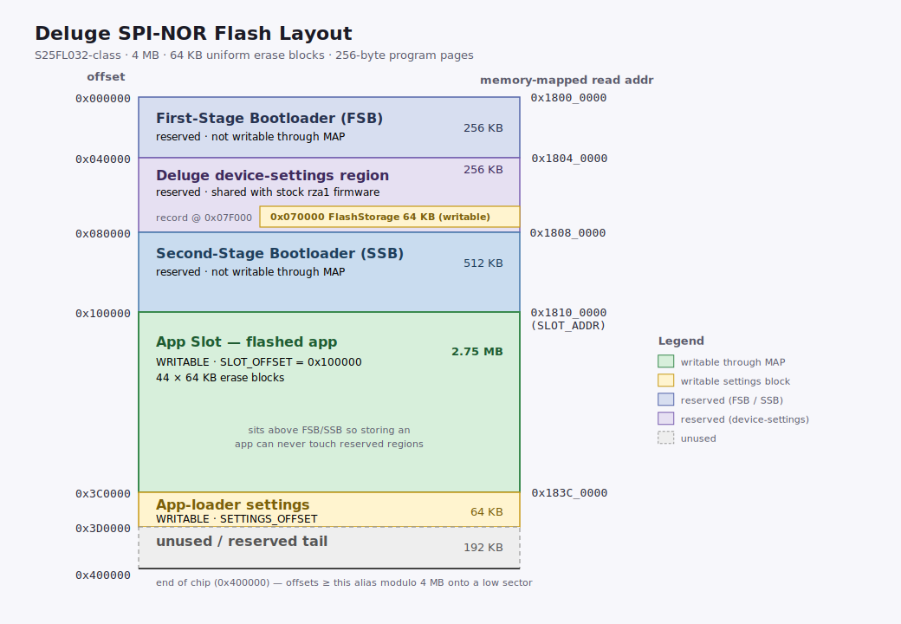

# App Loader Manual

The **app loader** is the second-stage bootloader from the Deluge SDK. Once
installed it runs every time you power the unit on: it puts a small boot menu
on the OLED and lets you pick which application firmware to launch — from
the SD card, from on-board flash, or straight over USB while you are developing.

This document is the operator's manual: how to install it, what each menu entry
means, and the day-to-day controls.

---

## What it is

The Deluge's *first-stage* bootloader (in SPI flash, untouched by the SDK) loads
the app loader from flash into SRAM at `0x20020000` and jumps to it. From there
the app loader is in charge: it brings the platform up, finds the firmware images
available to it, and hands control to the one you choose.

Apps are **ELF binaries that run from RAM**. The loader copies a chosen image's
`PT_LOAD` segments to their physical addresses, flushes the caches, and branches
to the image's entry point. Nothing your *app* does has to touch flash, so a
misbehaving app can never brick the unit — power-cycle and you are back at the
menu.

| | |
|---|---|
| Role | Second-stage bootloader / application launcher |
| Loaded at | SRAM `0x20020000` (by the first-stage bootloader) |
| Display | 128 × 48 OLED, encoder-driven menu |
| Boots from | SD card `/APPS/`, on-board flash slot, or USB (dev mode) |

---

## Installing the loader

The app loader is flashed onto your Deluge exactly like
a normal Deluge firmware update. The Deluge's first-stage bootloader programs the
`.bin` into what is typically taken up by the Deluge's firmware, making the loader the new default firmware.

1. Download the `app-loader.bin` from the GitHub Releases page.
2. Copy `app-loader.bin` to the top level of your SD card.
3. Insert the card, **hold SHIFT while powering on**.
   image. The binary should flash to the internal memory.
4. Power-cycle. You should land on the app-loader's **boot menu**.

Because it installs through the same update path as stock firmware, you can always
re-flash, including back to the previous Official or Community firmwares.

---

## Flash layout

The loader only ever writes to two regions of the SPI-NOR chip — the **app slot**
and its own **settings** sector. Both sit *above* the reserved first-stage
bootloader, device-settings, and second-stage-bootloader regions, so storing an
app or toggling a setting can never overwrite anything the unit needs to boot.

<p align="center">
  
</p>

| Offset | Size | Region | Writable |
|--------|------|--------|----------|
| `0x000000` | 256 KB | First-Stage Bootloader (FSB) | no |
| `0x040000` | 256 KB | Deluge device settings | no |
| `0x080000` | 512 KB | Second-Stage Bootloader (SSB) | no |
| `0x100000` | 2.75 MB | **App slot** (`SLOT_OFFSET`) — flashed app | **yes** |
| `0x3C0000` | 64 KB | **App-loader settings** (`SETTINGS_OFFSET`) — dev-mode flag | **yes** |
| `0x3D0000` | 192 KB | unused / reserved tail | no |

The two writable windows are the *only* offsets the loader's flash routines will
erase or program; everything else is physically guarded.

---

## Boot sequence

On power-up the loader:

1. **Initialises the platform** — MMU, caches, SDRAM, GIC, and the OSTM timers,
   then the PIC link and OLED.
2. **Probes the on-flash app slot.** If a valid image is present it becomes the
   default boot entry, listed first as **`BOOT FLASH`**. This is independent of
   the SD card, so a unit with flashed firmware boots with no card inserted.
3. **Mounts the SD card** and lists ELF images from the `/APPS/` folder. A
   missing or unreadable card is not fatal — the menu just omits SD entries.
4. **Builds the boot menu** and shows it on the OLED with a 5-second auto-boot
   countdown of the default entry.
5. **Launches your selection** — streams the chosen ELF, loads its `PT_LOAD`
   segments, flushes the caches, blanks the OLED, quiesces all DMA/timers/IRQs,
   and branches to the entry point. This never returns; the app owns the machine
   until the next power-cycle.

---

## The boot menu

```text
┌───────────────────────────────┐
│ BOOT IN 5s                  ▓ │   ← title bar (countdown, then "SELECT APP")
│ ──────────────────────────────│
│ ▶ BOOT FLASH                ▓ │   ← default entry (on-flash firmware)
│   MYSYNTH.ELF               ░ │   ← SD /APPS images
│   SEQUENCER.ELF             ░ │
│   DATA TRANSFER             ░ │   ← synthetic entries (always present)
└───────────────────────────────┘
     scrollbar on the right edge ┘
```

The menu lists, in order:

1. **`BOOT FLASH`** — the image stored in the on-board flash slot, if one is
   present. This is the auto-boot default.
2. **Your SD `/APPS/` images** — every loadable ELF on the card, by filename.
3. **`DATA TRANSFER`** — a synthetic entry; see below.
4. **`DEV MODE: ON` / `DEV MODE: OFF`** — a synthetic entry reflecting and
   toggling the dev-mode flag.

Up to four entries are visible at once; a proportional scrollbar appears on the
right when the list is longer. A solid triangle (`▶`) marks the highlighted
entry.

### Controls

| Action | Control |
|--------|---------|
| Move the cursor | Turn the **SELECT** encoder |
| Launch the highlighted entry | **Short-press** SELECT |
| Store an SD app to flash | **Long-press** SELECT (hold ≥ 0.7 s) on an SD entry |
| Cancel the auto-boot countdown | Turn the encoder (any movement) |
| Exit a USB mode back to the menu | Press **BACK** |

The countdown auto-boots the default entry after **5 seconds**. Turning the
encoder cancels it and hands control to you indefinitely. The countdown does not
run when there is no real boot target, or when dev mode is on.

---

## Synthetic menu entries

### `DATA TRANSFER` — SD card over USB

Selecting **`DATA TRANSFER`** exposes the raw SD card to the host as a USB Mass
Storage device, so you can drop ELF files into `/APPS/`, back up projects, or
reformat the card from your computer. Press **BACK** on the Deluge to leave this
mode and return to the menu.

This entry is always present, even when the card appears absent — the Deluge's
card-detect pin is unreliable, and the backend retries the card on demand when
the host probes it. With no card the host simply sees an empty drive; this also
guarantees the menu always has at least one entry.

### `DEV MODE` — toggle USB upload

Selecting the **`DEV MODE`** entry flips the persistent dev-mode flag, saves it
to the flash settings sector, briefly confirms `DEV MODE ON`/`OFF`, and rebuilds
the menu. **Nothing is launched.** See [Dev mode](#dev-mode) below.

If the flash write does not stick, the loader stays responsive and shows a
diagnostic line with the chip's JEDEC ID and status register (e.g.
`ID 01 02 20 SR..`) so a write-protected settings sector can be diagnosed.

---

## Dev mode

Dev mode is a **persistent, default-off** setting stored in the flash settings
sector (`0x3C0000`). Because it survives reboots and is independent of the SD
card, a stock unit will **never** accept firmware over USB until you explicitly
turn it on — turn it off again to lock the unit back down.

While dev mode is **on**, the loader:

- runs a USB **CDC-ACM upload listener** in the background, alongside the boot
  menu — there is no separate "upload mode" to enter; and
- **disables the auto-boot countdown**, so the unit waits indefinitely on the
  menu for either a menu selection or a USB upload.

This is the foundation of the push-to-run dev loop. With dev mode on, run:

```sh
cargo deluge run
```

The host frames your ELF (`DLUP | version | flags | len | crc32 | <ELF>`) and
pushes it over USB. The listener streams it into a high-SDRAM scratch window,
validates the CRC, loads its `PT_LOAD` segments to RAM, and launches it — exactly
like the SD `/APPS/` path, but with no card shuffling and no debug probe. Edit,
`cargo deluge run`, watch it run, repeat.

Making a menu selection while the listener is live tears the CDC device down
first, so a later `DATA TRANSFER` mode has the USB port free.

---

## Storing an app to flash

To make an SD app boot with **no card inserted**, store it into the on-board
flash slot:

1. Highlight the SD `/APPS/` ELF entry.
2. **Long-press** SELECT (hold ≥ 0.7 s). A `WRITE TO FLASH?` prompt appears.
3. Choose **`YES`**.

The loader flattens the ELF into a flat `.bin`, validates its first-stage-boot
(FSB) metadata, and programs it into the app slot (`0x100000`). A progress bar
tracks the flatten (first half) and the program (second half). On success it
shows `FLASHED OK / NOW DEFAULT` and the image becomes the first/default
**`BOOT FLASH`** entry on the next menu pass.

Safety notes:

- Only **fully SRAM-linked** images can be stored. The loader rejects anything
  that fails FSB validation *before* touching the slot, so a bad ELF can never
  corrupt an image already in flash. Errors are reported on the OLED
  (`BAD MAGIC`, `WRONG FORMAT`, `NOT FLASHABLE`, `TOO LARGE`, `VERIFY FAILED`,
  …) and the loader returns to the menu.
- Long-pressing the existing `BOOT FLASH` entry or `DATA TRANSFER` does nothing
  special — only SD ELF entries can be stored.

---

## Recovery

The loader is designed so you can always get back to a working state:

- **A bad app** can't brick anything — apps run from RAM. Power-cycle to return
  to the menu.
- **No SD card / unreadable card** — the menu still appears; use `BOOT FLASH`
  if a flashed image is present, or `DATA TRANSFER` to fix the card from a host.
- **A corrupt or unformatted card** — select `DATA TRANSFER` and reformat or
  repopulate `/APPS/` from your computer.
- **Locking a unit down** — turn dev mode **off** so it will no longer accept
  USB uploads.
- **Reinstalling the loader itself** — see the
  [Device setup guide](device-setup.md).

---

## See also

- [Getting started guide](getting-started.md) — toolchain, `cargo deluge`, and
  your first app.
- [Device setup guide](device-setup.md) — installing the app loader onto a unit.
- [`app-loader/README.md`](../app-loader/README.md) — module-by-module source
  reference.
