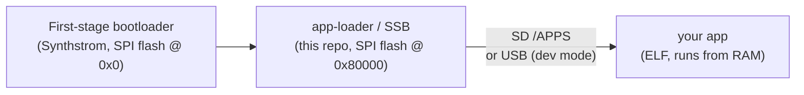

# Device setup: from a clone to running your own apps

> [!Note]
> The Deluge SDK is intended for the OLED Deluge _only_. Legacy (i.e. 7SEG) Deluges are not
> supported and use of the App Loader and SDK are untested on the 7SEG Deluge.

This guide takes you from a fresh checkout of this repo and a Synthstrom Deluge
to **running your own apps on the hardware**. It covers the device/firmware side:
the toolchain, installing `cargo deluge`, building and flashing the **app-loader**,
turning on **dev mode**, and building and installing apps.

> **Just want to write apps?** If your Deluge already runs the app-loader, skip
> straight to the [SDK getting-started guide](getting-started.md) — it covers
> `#[deluge::app]`, the `Deluge` capability handle, and every peripheral. This
> page is the one-time device bring-up that gets you there.

## How the pieces fit

A Deluge boots through three stages. Only the middle one — the **app-loader**
(a.k.a. the second-stage bootloader, "SSB") — comes from this repo:



- The **first-stage bootloader** is Synthstrom's; it loads the app-loader from
  SPI flash into SRAM.
- The **app-loader** presents the OLED boot menu, launches app ELFs from the SD
  card's `/APPS/` folder, and — in dev mode — accepts a direct USB upload.
- **Your apps** are ordinary ELF binaries that **run from RAM**. Nothing an app
  does touches flash, so **an app can't brick the unit** — power-cycle to recover.

The result is a fast, probe-free loop: with dev mode on, `cargo deluge run`
pushes an ELF over USB and the app-loader launches it from RAM.

---

## 1. Toolchain prerequisites

The required Rust toolchain (nightly + the `armv7a-none-eabihf` target +
`rust-src` + `llvm-tools-preview`) is pinned in
[`rust-toolchain.toml`](../rust-toolchain.toml) and installed automatically on
first use:

```sh
rustup show          # installs the pinned nightly + target on first run
```

The firmware `*-bin` build aliases flatten an ELF to a raw binary with
`llvm-objcopy`, which ships in `cargo-binutils`:

```sh
cargo install cargo-binutils
```

---

## 2. Install `cargo deluge`

`cargo deluge` is the host tool that scaffolds, builds, deploys, and tails apps
so you never touch `-Zbuild-std`, linker flags, or the embedded target triple by
hand. Install it from this repo:

```sh
cargo install --path tools/cargo-deluge
```

Verify it's on your `PATH`:

```sh
cargo deluge help
```

---

## 3. Build the app-loader

Build the app-loader to a raw flashing binary from the workspace root (the alias
supplies the required `-Zbuild-std=core` flags):

```sh
cargo build-app-loader-bin
# → target/armv7a-none-eabihf/release/app-loader.bin
```

> For probe-based development you can also run the app-loader straight from SRAM
> without flashing it — `cargo build-app-loader` produces the debug ELF, and a
> J-Link / `probe-rs` session loads and runs it (see the
> [root README → Debugging](../README.md#debugging)). Flashing (below) is what
> makes it boot on its own, with no probe attached.

---

## 4. Flash the app-loader onto the Deluge

The app-loader is installed **like any Deluge firmware update**: the Synthstrom
first-stage bootloader programs the image into the second-stage (app-loader) slot
in SPI flash. Use Synthstrom's **official firmware-update procedure** for your
unit, with `app-loader.bin` (from step 3) as the firmware image to install —
typically copying it to the SD card and applying the update from the device.

Follow Synthstrom's instructions for the exact steps (file naming, the button
sequence to trigger an update) — this repo doesn't change that path:

- Synthstrom Deluge: <https://synthstrom.com/product/deluge/>

> **This is recoverable.** Because installation goes through the same first-stage
> update path as stock firmware, you can always re-flash by repeating the
> procedure — installing the app-loader does not overwrite the first-stage
> bootloader.

After flashing, power-cycle. You should land on the app-loader's OLED **boot
menu**.

---

## 5. Prepare the SD card

The app-loader launches apps from a `/APPS/` directory on the card's first FAT
volume. To format a card and create that directory:

```sh
sudo ./tools/format-sdcard.sh /dev/sdX     # whole-disk device, NOT a partition
```

Run it with no device to list candidate removable disks first. It wipes the
target disk, so double-check the device — there is no undo. (An already-FAT card
works too; just create an empty `/APPS/` folder at its root.)

---

## 6. Turn on dev mode

`cargo deluge run` uploads over USB, which the app-loader only accepts when
**dev mode** is on. It's a **persistent, default-off** flag (stored in SPI
flash), so a stock unit never takes firmware over USB until you opt in.

On the boot menu, scroll to **`DEV MODE: OFF`** and press **SELECT** — it flips
to **`DEV MODE: ON`** and is saved (it survives reboots). While on, the loader
listens for an upload in the background and disables the auto-boot countdown, so
the unit waits on the menu indefinitely. Toggle it off the same way.

---

## 7. Build and install an app

Scaffold a fully self-contained app crate and push it to the unit:

```sh
cargo deluge new myapp
cd myapp
cargo deluge run            # build + upload over USB, launched from RAM (DEV MODE)
```

With **DEV MODE: ON** and the Deluge on its boot menu, `cargo deluge run` finds
the unit's USB serial port, uploads the ELF, and the app-loader launches it
straight from RAM. The scaffolded app blinks the SYNC LED.

There are two ways to get an app onto the unit:

| Path | Command | When |
|------|---------|------|
| **USB push (dev mode)** | `cargo deluge run [--release] [--port <p>] [--log]` | Fast iteration. Requires **DEV MODE: ON**; app runs from RAM, nothing persists. |
| **SD card** | `cargo deluge deploy --dest <sd-mount>` | No USB/dev mode. Copies the ELF to `<sd-mount>/APPS/<name>.elf`; power-cycle and pick it from the menu. |

> No card mounted on your host? Enter the Deluge's **DATA TRANSFER** mode from
> the boot menu (the card appears as a USB drive) and copy the ELF into `/APPS/`
> by hand. The ELF is built to `target/armv7a-none-eabihf/{debug,release}/<name>`.

To make an app boot without a probe or host, you can also store an SD `/APPS`
ELF into the on-board flash app slot: **long-press SELECT** on its menu entry and
choose `WRITE TO FLASH?` — see [`app-loader/README.md`](../app-loader/README.md).

---

## 8. See log output

Apps log through the `log` macros (`info!`, `warn!`, …). Enable the **`usb-log`**
feature to route logs to a USB serial port — no probe required — then tail it:

```sh
cargo deluge run --log       # build, upload, then tail the USB log
# or, against an already-running app:
cargo deluge log             # connect to the app's USB serial-log channel
```

See [`examples/usb_log`](../examples/usb_log) and the SDK guide's
[Debugging & logging](getting-started.md#7-debugging--logging) section for the
`rtt` (probe) alternative.

---

## 9. Troubleshooting

- **`cargo deluge` not found** — install it: `cargo install --path tools/cargo-deluge`.
- **`cargo build-app-loader-bin` fails on `objcopy`** — install `cargo-binutils`
  (step 1).
- **No boot menu after flashing** — the app-loader image didn't install; re-run
  the Synthstrom update procedure with `app-loader.bin`, and confirm the card has
  a valid FAT volume.
- **`run` can't find the Deluge** — make sure **DEV MODE: ON** and the unit is
  sitting on its boot menu (the USB listener only runs there); pass `--port <p>`
  to override auto-detection, or fall back to `cargo deluge deploy --dest <sd>` /
  DATA TRANSFER.
- **App doesn't appear on the menu** — it must be an ELF in `/APPS/` on the
  card's first FAT volume; re-check the path and power-cycle.
- **No log output** — build with the `usb-log` (or `rtt`) feature; without a
  logger the `log` macros are no-ops.

---

## 10. Where to go next

- **Write apps** — the [SDK getting-started guide](getting-started.md): the
  `#[deluge::app]` macro, the `Deluge` handle, and a tour of every capability
  (OLED, pads, audio, MIDI, CV/gate, SD, …).
- **Go deeper** — the [Advanced developer guide](advanced-guide.md): Embassy
  tasks, interrupts/GIC, SDRAM, dropping to the HAL/BSP, and Cortex-A9 trace
  tooling.
- **The app-loader internals** — [`app-loader/README.md`](../app-loader/README.md).
- **Repository overview** — the [root README](../README.md).
