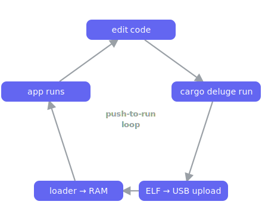

# Getting started with the Deluge SDK

The **Deluge SDK** lets you write apps for the [Synthstrom Deluge] in async Rust.
A single attribute — `#[deluge::app]` — absorbs all of the platform bring-up
(heaps, clocks, interrupts, the async executor, and a panic handler), and a
`Deluge` capability handle hands you the hardware: OLED, pads, buttons, encoders,
LEDs, audio DSP, CV/gate, MIDI, the SD card, and more.

Apps are **ELF binaries that run from RAM**, loaded by the on-device app-loader
either straight over USB (dev mode) or from the `/APPS/` folder on the SD card.
That means:

- **You can't brick the device.** Nothing your app does touches flash; power-cycle
  to recover.
- **Iteration is push-to-run.** With **DEV MODE** on, `cargo deluge run` uploads
  the ELF over USB and the loader launches it from RAM — no SD shuffling, no
  probe. (Or copy the ELF to `/APPS/` and reboot.)

<p align="center">
  
</p>

> **Licensing:** the SDK (`deluge`) and core libraries are `MIT OR Apache-2.0`.
> The optional OLED UI toolkit (`deluge-ui-toolkit`) and its fonts are
> `GPL-3.0-or-later`; an app that opts into the toolkit becomes GPL. See the
> [root README](../README.md#licensing).

---

## 1. Prerequisites

This guide assumes your Deluge is already set up to run apps. If it isn't — or
you're starting from a fresh clone — do the one-time
[**Device setup**](device-setup.md) first; it's the single source of truth for
flashing the app-loader, preparing the SD card, and the full toolchain. The
checklist you need here:

- **Rust toolchain** — pinned in [`rust-toolchain.toml`](../rust-toolchain.toml);
  `rustup show` installs it on first run (nightly + the `armv7a-none-eabihf`
  target + `rust-src`).
- **`cargo deluge`** — the host tool that scaffolds, builds, and deploys apps so
  you never touch `-Zbuild-std`, linker flags, or the target triple by hand:
  `cargo install --path tools/cargo-deluge`.
- **A Deluge running the app-loader** — the on-device menu that launches your
  app ELFs. Flashing it is the one-time [Device setup](device-setup.md) step
  (see [`app-loader/README.md`](../app-loader/README.md) for its internals).
- **DEV MODE: ON** — required for `cargo deluge run`'s USB upload. On the boot
  menu, select **`DEV MODE: OFF`** to flip it to **`DEV MODE: ON`** (persistent,
  default-off, survives reboots). Without it, deploy to the SD card's `/APPS/`
  instead — see [Device setup → Build and install an app](device-setup.md#7-build-and-install-an-app).

---

## 2. Your first app in 5 minutes

```sh
cargo deluge new myapp
cd myapp
cargo deluge run            # build + upload over USB, launched from RAM (DEV MODE)
```

With **DEV MODE: ON** and the Deluge sitting on its boot menu, `cargo deluge run`
finds the unit's USB serial port, uploads the ELF, and the loader launches it
straight from RAM. The scaffolded app blinks the SYNC LED. Add `--log` to tail
the app's USB log after it starts; pass `--port <path>` if auto-detection picks
the wrong port.

> Prefer the SD card? `cargo deluge deploy --dest /run/media/you/DELUGE` copies
> the ELF to `<dest>/APPS/`; then power-cycle and pick `myapp` from the menu.

`cargo deluge new` generates a **fully self-contained app crate**:

```
myapp/
├── Cargo.toml            # depends on `deluge` + embassy-executor/-time
├── rust-toolchain.toml   # pinned nightly + armv7a-none-eabihf
├── .cargo/config.toml    # target triple, Cortex-A9/NEON flags, -Zbuild-std=core
├── build.rs              # selects the memory layout / linker script
├── memory.x              # default layout
├── memory_rtt.x          # layout with the RTT buffer reserved
└── src/main.rs           # a working blinky
```

The generated `src/main.rs`:

```rust
#![no_std]
#![no_main]
// Required by the Embassy task the `#[deluge::app]` macro generates.
#![feature(impl_trait_in_assoc_type)]

use deluge::prelude::*;
use embassy_time::Timer;

#[deluge::app]
async fn main(dlg: Deluge) {
    // The platform (heaps, clocks, interrupts, executor, panic handler) is
    // already up. Capabilities are taken from the `dlg` handle:
    //   let mut oled = dlg.oled().await;
    //   let input = dlg.input();
    //   let mut pads = dlg.pads().await;
    let mut led = dlg.sync_led();
    loop {
        led.toggle();
        Timer::after_millis(200).await;
    }
}
```

> **No USB upload available?** If the unit isn't in dev mode (or you have no USB
> link), use `cargo deluge deploy --dest <sd-mount>` to copy the ELF to `/APPS/`,
> or enter the Deluge's **DATA TRANSFER** mode (the card mounts as a drive) and
> copy it across by hand, then power-cycle / pick it from the app menu.

---

## 3. Anatomy of an app

### The four inner attributes

Every app crate root needs these:

| Attribute | Why |
|-----------|-----|
| `#![no_std]` | Bare-metal target; there is no `std`. |
| `#![no_main]` | The macro provides the real `extern "C" fn main`. |
| `#![feature(impl_trait_in_assoc_type)]` | Required by the Embassy task the macro expands to. |
| `use deluge::prelude::*;` | Brings in the macro, the `Deluge` handle, all capability types, `controls`, `Color`, `Event`, and the `log` macros. |

### The entry point

```rust
#[deluge::app]
async fn main(dlg: Deluge) { /* ... */ }
```

The annotated function **must be `async`** and may take **at most one argument**
— the `Deluge` handle. (If you don't need it, write `async fn main()` or
`async fn main(_dlg: Deluge)`.)

The macro ([`crates/deluge-sdk-macros/src/lib.rs`](../crates/deluge-sdk-macros/src/lib.rs))
expands your function into:

- an `#[embassy_executor::task]` wrapping your body,
- an `extern "C" fn main` that runs the SDK runtime, and
- a `#[panic_handler]`.

The runtime startup sequence
([`crates/deluge-sdk/src/lib.rs`](../crates/deluge-sdk/src/lib.rs), `__rt::run`) is:

> logging → heaps + clocks → optional `setup()` (interrupts masked) → enable
> interrupts → start the executor and spawn your `main`.

### The optional `setup` hook

`setup =` is the **only** argument the macro accepts. It names a synchronous
function that runs *after* clocks are up but *before* interrupts are enabled —
the window for peripheral or GIC bring-up that must happen with IRQs masked:

```rust
#[deluge::app(setup = setup)]
async fn main(dlg: Deluge) { /* interrupts on, executor running */ }

fn setup() { /* interrupts masked; register ISRs, configure GIC sources */ }
```

Most apps don't need it.

### Panics are handled for you

If your app panics, the SDK draws `APP PANIC` plus the source `file:line` to the
OLED (best-effort) and strobes the SYNC LED forever — a visible crash indicator
even without a debug probe. You don't write a panic handler.

---

## 4. The `Deluge` handle and the take-once model

Each capability is taken from the `dlg` handle. **Each accessor is take-once: a
second call panics.** Owning the returned handle is what stops two parts of your
app from driving the same hardware — no `unsafe`, no shared globals.

```rust
let mut led = dlg.sync_led();   // OK
let mut led2 = dlg.sync_led();  // panics: "sync_led() called more than once"
```

Some accessors are `async` because they bring up and wait on shared services
(the PIC co-processor, the panel init sequence, the SD card): `oled()`, `leds()`,
`pads()`, and `sd()`. Spawn your own background tasks with `dlg.spawner()`.

---

## 5. Capability tour

Each subsection is drawn from a runnable example under
[`examples/`](../examples/) — read the full example for context.

### SYNC LED — [`examples/blinky`](../examples/blinky)

```rust
let mut led = dlg.sync_led();
led.toggle();           // also: on(), off(), set(bool)
```

`SyncLed` implements the `embedded-hal` `OutputPin`/`StatefulOutputPin` traits.

### OLED display — [`examples/oled_hello`](../examples/oled_hello)

`dlg.oled().await` brings up the PIC service, runs the panel init, and returns an
`Oled` that is an `embedded-graphics` `DrawTarget` over `BinaryColor` — so the
whole embedded-graphics ecosystem (fonts, shapes) works directly:

```rust
use embedded_graphics::{
    mono_font::{MonoTextStyle, ascii::FONT_6X10},
    pixelcolor::BinaryColor,
    prelude::*,
    text::Text,
};

let mut oled = dlg.oled().await;
let style = MonoTextStyle::new(&FONT_6X10, BinaryColor::On);

oled.clear();
Text::new("hello deluge", Point::new(2, 12), style).draw(&mut oled).ok();
oled.flush().await;
```

For quick text without pulling in embedded-graphics, `Oled` also has a built-in
font: `oled.text(x, y, "BPM 120")`. Note the panel's top rows sit behind the
faceplate — `Oled::VISIBLE_TOP` / `Oled::VISIBLE_HEIGHT` give the visible window.

### Input stream — [`examples/input_demo`](../examples/input_demo)

`dlg.input()` merges pads, buttons, and encoders into one async event queue:

```rust
let input = dlg.input();
loop {
    match input.next().await {
        Event::Pad { x, y, pressed } => { /* x: 0..18, y: 0..8 */ }
        Event::Button { id, pressed } => { /* id matches controls::button::* */ }
        Event::Encoder { index, delta } => { /* signed detents */ }
        _ => {}
    }
}
```

Use `input.try_next()` for a non-blocking poll. Named control ids live in
`controls::{button, encoder, encoder_button}`.

### RGB pads — [`examples/pad_paint`](../examples/pad_paint)

```rust
let mut pads = dlg.pads().await;          // 18 × 8 grid (Pads::COLS / Pads::ROWS)
pads.set(x, y, Color::hsv(hue, 255, 200)); // also Color::rgb(r,g,b), Color::scale(f)
pads.flush().await;                        // sends only changed columns
```

`Color` has named constants (`RED`, `GREEN`, `BLACK`, …). `pads.fill(color)` and
`pads.clear()` cover the whole grid; pad coordinates match `Event::Pad`.

### Button LEDs + gold knobs — [`examples/button_leds`](../examples/button_leds)

```rust
let mut leds = dlg.leds().await;
leds.set(id, pressed).await;          // also on(id)/off(id)/clear(); id 0..36
leds.gold_knob(0, [255; 4]).await;    // knob 0..2, 4 LEDs bottom→top, 0..256
```

### Audio DSP — [`examples/audio_passthru`](../examples/audio_passthru)

`dlg.audio().process(...)` runs a per-block callback over the codec forever; each
block arrives pre-loaded with line-in and is written back to line-out:

```rust
dlg.audio()
    .process(|block: &mut [StereoFrame]| {
        for f in block {
            f.l *= 0.5;   // samples are f32 in [-1.0, 1.0]
            f.r *= 0.5;
        }
    })
    .await
```

A clean passthrough is `.process(|_| {})`. Acquire `audio()` before your main
loop (its one-time bring-up blocks briefly), and don't also run a USB-audio
stack. For a drift-free, lower-latency clock, enable the **`audio-irq`** feature
(same `process()` API) — see [`examples/audio_passthru_irq`](../examples/audio_passthru_irq).

### CV / gate and MIDI — [`examples/midi_cv`](../examples/midi_cv)

```rust
let midi = dlg.midi();      // DIN MIDI
let mut cv = dlg.cv();      // 2 channels (Cv::CHANNELS)
let mut gate = dlg.gate();  // 4 channels (Gate::CHANNELS)

let status = midi.recv().await;     // also send(&[u8]), try_recv()
cv.set_volts(0, 1.0).await;         // also set(ch, code: u16)
gate.set(0, true);
```

### Clock I/O and jacks — [`examples/clock_jacks`](../examples/clock_jacks)

```rust
let mut clk_in = dlg.clock_in();
if let Some(dt) = clk_in.tick().await { /* dt = interval since last pulse */ }

let mut clk_out = dlg.clock_out(0);                 // pulses a gate channel
clk_out.run(ClockOut::period_from_bpm(120.0, 24)).await;  // free-run forever

let mut jacks = dlg.jacks();
if jacks.headphone() { /* ... */ }
jacks.apply_speaker_mute();   // stock policy: amp off when HP/line-out present
```

> `clock_out(ch)` pulses a V-trig gate output — don't also drive that channel
> through `gate()`.

### SD card — [`examples/sd_demo`](../examples/sd_demo)

`dlg.sd().await` initialises the card and returns a root-directory file handle
(`Err` if no card). Each call mounts FAT, does the I/O, and unmounts:

```rust
let mut sd = dlg.sd().await?;          // returns Result<Sd, SdError>
let mut buf = [0u8; 32];
sd.write("CONFIG.TXT", b"hello")?;     // FatError on failure
let n = sd.read("CONFIG.TXT", &mut buf)?;
```

### Fixed-point DSP math

For DSP in audio callbacks, `deluge::fixed` re-exports the `fixedpoint` crate
(type-safe `Q31`/`Q16`/… arithmetic that maps onto the Cortex-A9's hardware DSP
instructions).

---

## 6. OLED UI toolkit (optional, GPL)

For richer screens, the **`deluge-ui-toolkit`** crate provides immediate-mode
menus: a vertical `Menu` (settings form) and a horizontal `HMenu` (parameter
columns / performance view). See [`examples/oled_menu`](../examples/oled_menu)
and [`examples/oled_hmenu`](../examples/oled_hmenu).

The toolkit needs a global allocator, so an app that uses it must:

- enable the `deluge` crate's **`alloc`** feature (registers the on-chip SRAM
  heap), and
- build with `-Zbuild-std=core,alloc` (the `cargo build-fw-alloc` alias in-repo).

Remember this makes your app **GPL-3.0** (see [Licensing](#getting-started-with-the-deluge-sdk)).

---

## 7. Debugging & logging

Use the `log` macros (`info!`, `warn!`, `error!`, `debug!`, from the prelude).
They need a sink, chosen by feature flag. **Only one global logger exists**, and
`usb-log` takes precedence over `rtt` if both are enabled.

- **`usb-log` (recommended, no probe)** — routes `log` output to a USB CDC serial
  port. Build with the feature, plug in USB, and open the serial port (e.g.
  `/dev/ttyACM0`). The runtime registers the logger automatically. See
  [`examples/usb_log`](../examples/usb_log).
- **`rtt` (J-Link / probe)** — SEGGER RTT logging; reserves SRAM only when
  enabled. See the [root README's Debugging section](../README.md#debugging) for
  J-Link and probe-rs details.
- **Panics** show `APP PANIC` + `file:line` on the OLED and strobe the SYNC LED
  (always on, no setup).

---

## 8. Feature-flag reference (`deluge` crate)

All features are **off by default**.

| Feature | Effect | Build implication |
|---------|--------|-------------------|
| `usb-log` | Route `log` to a USB CDC serial port (no probe). | Wins over `rtt` (one logger). |
| `rtt` | SEGGER RTT logging over a debug probe. | Reserves SRAM (uses `memory_rtt.x`). |
| `audio-irq` | Drift-free, DMA-clocked audio (same `process()` API). | — |
| `alloc` | Register the on-chip SRAM heap as the global allocator (needed by the GPL UI toolkit). | Needs `-Zbuild-std=core,alloc` (`cargo build-fw-alloc`). |

Enable them on the `deluge` dependency, e.g. `deluge = { ..., features = ["usb-log"] }`,
or via your app's own feature that forwards to `deluge/<feature>` (the scaffold
already wires up `rtt` this way).

---

## 9. Building & deploying (reference)

| Command | What it does |
|---------|--------------|
| `cargo deluge build [--release]` | Build the current app crate → ELF. |
| `cargo deluge run [--release] [--port <p>] [--log]` | Build, then upload the ELF over USB and launch it from RAM (requires **DEV MODE: ON** on the unit). `--port` overrides port auto-detection; `--log` tails the app's USB log after launch. |
| `cargo deluge deploy [--release] --dest <sd-mount>` | Build, then copy the ELF to `<sd-mount>/APPS/<name>.elf` (omit `--dest` to print how to deploy by hand). |
| `cargo deluge debug [--release] [-- <args>]` | Build, then `probe-rs run` over J-Link (chip preset to `R7S721020`). Needs the `trace-a9` probe-rs fork. |
| `cargo deluge trace [--release] [--flow] [--duration-ms N] [-- <args>]` | Build, then `probe-rs read-trace` (Cortex-A9 PTM trace). `--flow` for the compact execution-flow view, else decoded packets. |

The ELF lands in `target/armv7a-none-eabihf/{debug,release}/<name>`. Because the
scaffold ships its own `.cargo/config.toml`, a plain `cargo build` works inside
your app crate too.

**In-repo examples** build through the workspace aliases instead:

```sh
cargo build-fw -p blinky        # debug ELF for one example
./tools/build-examples.sh       # compile-prove all examples
```

---

## 10. Troubleshooting

App and runtime issues are below; for setup/flashing problems (no boot menu,
`objcopy` errors, app missing from the menu) see
[Device setup → Troubleshooting](device-setup.md#9-troubleshooting).

- **Panic: `… called more than once`** — a capability accessor was taken twice;
  acquire each handle once and pass it around.
- **`run` can't find the Deluge** — make sure **DEV MODE: ON** and the unit is
  sitting on its boot menu (its USB listener only runs there); pass `--port <p>`
  to override auto-detection, or fall back to `--dest <sd-mount>` / DATA TRANSFER.
- **`cargo deluge debug`/`trace` say `probe-rs not found`** — install the
  `trace-a9` fork (the command prints the two-line install).
- **UI toolkit won't link / allocation errors** — enable the `alloc` feature and
  build with `cargo build-fw-alloc` (`-Zbuild-std=core,alloc`).
- **No log output** — pick a logger feature (`usb-log` or `rtt`); without one the
  `log` macros are no-ops.
- **Audio glitches / `audio()` blocks at startup** — acquire `audio()` (and
  `cv()`) before entering your main loop; their one-time bring-up reconfigures
  shared hardware.

---

## 11. Where to go next

- **Examples** — every capability has a runnable example:

  | Example | Shows |
  |---------|-------|
  | [`blinky`](../examples/blinky) | Minimal app; SYNC LED |
  | [`oled_hello`](../examples/oled_hello) | OLED text via embedded-graphics |
  | [`input_demo`](../examples/input_demo) | Unified pad/button/encoder stream |
  | [`pad_paint`](../examples/pad_paint) | RGB pads + input |
  | [`button_leds`](../examples/button_leds) | Indicator LEDs + gold knobs |
  | [`audio_passthru`](../examples/audio_passthru) / [`audio_passthru_irq`](../examples/audio_passthru_irq) | Per-block audio DSP (poll / DMA-IRQ) |
  | [`midi_cv`](../examples/midi_cv) | MIDI → CV/gate |
  | [`clock_jacks`](../examples/clock_jacks) | Clock I/O + jack detection |
  | [`sd_demo`](../examples/sd_demo) | SD-card read/write |
  | [`oled_menu`](../examples/oled_menu) / [`oled_hmenu`](../examples/oled_hmenu) | OLED UI toolkit menus (GPL, `alloc`) |
  | [`usb_log`](../examples/usb_log) | Probe-free logging over USB CDC |

- **Going deeper** — the [Advanced developer guide](advanced-guide.md) covers
  Embassy tasks, interrupts/GIC, SDRAM allocation, dropping to the HAL/BSP, audio
  internals, and the Cortex-A9 probe-rs trace/PMU tooling.
- **Design rationale** — [`docs/dev/deluge-sdk.md`](dev/deluge-sdk.md).
- **Lower layers** — the board support package
  ([`crates/deluge-bsp`](../crates/deluge-bsp/README.md)) and HAL
  ([`crates/rza1l-hal`](../crates/rza1l-hal/README.md)) are re-exported from
  `deluge` for advanced use.
- **Repository overview** — the [root README](../README.md).

[Synthstrom Deluge]: https://synthstrom.com/product/deluge/
